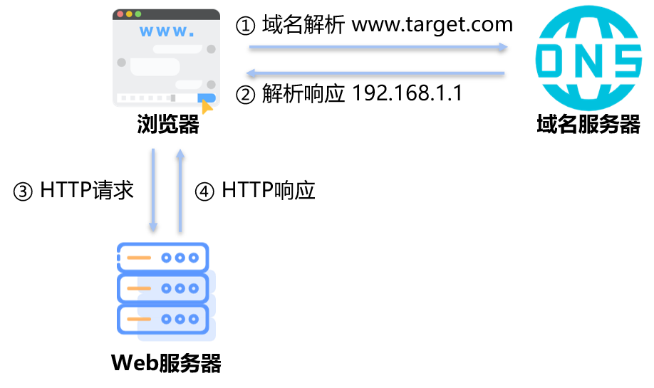

# 错综复杂的后端逻辑及安全

## 0x00 前言
### web vs binary
Web安全不同于二进制安全，更多在于经验的积累和知识体系的广度，应为在上层应用架构中，让web看似入门简单，因为复杂的架构和技术栈，其实精通很有难度。而并非像二进制基础知识具有很好的通用性和拓展性。    
对比二进制安全研究人员来说，逆向是binary的核心，其实web手也是。通过黑盒的测试来检测漏洞，通过获取的信息来判断后端的架构。

>其实这篇有很多想说的内容，但又一言难尽，等以后有机会好好整理一下思路。         

## 0x01 分层（纵向）
业务服务主要在计算机网络的传输层（TCP、UDP），http应用服务是web安全的重要组成部分，但不是全部，各类的应用服务（数据库、远程桌面等）不能忽略。

### 常见的应用服务

- 网站服务 (http[80],https[443]...)
- 远程控制 (ssh[22],telnet[23],rdp[3389]...)
- 数据库服务（mysql[3306],mssql[1433]...）
- 内存数据库服务 （redis[6379],memcache[11211]...）
- 文件管理服务(ftp[21],smb[193,445]...)
- 邮件服务（imap[143],pop3[110]...）
- 进程/设备间通信服务（RPC,MQTT(1883)...）

>Ps:不要忽略udp服务

### web应用分层
新增了容器和虚拟化      
#---用户侧---#
- 前端（html，JavaScript等）
- Web应用（CMS，OA，ERP等）
- MVC框架&组件（Thinkphp，FCKeditor等）
- 运行语言（PHP，.NET，Java Web等）
- Web中间件（Apache，Nginx，Tomcat等）
- 数据库系统（Mysql，Mssql等）
- 容器（Docker等）操作系统（Linux，Windows等）    
- 虚拟层（qemu，VM等）    
#---硬件侧---#

## 0x02 架构（横向）
通过[千万级并发下，淘宝服务端架构如何演进？](https://developer.51cto.com/art/201906/597895.htm)就可以知道，web应用的一个演化过程。对于用户侧呈现的web页面，其实背后可能是单个服务器支撑，也可能是复杂的架构系统。

本节主要站在攻击者角度来说，后端架构对于渗透测试的影响。

### 单机架构
对于攻击者而言，web服务和数据库系统都处于一台服务器中，结构简单。    
不同攻击面漏洞可以相互影响，例如：数据库写操作可以写入web执行路径中进而getshell。     

### 站库分离
网站应用服务和数据库不在同一个服务器上。   
其实这是对于攻击者来说，一个架构阶段，作为开发者可能这是部署的方式而已。因为作为web入门漏洞SQL注入来说，是否是站库分离就很关键了。   

### CDN
>CDN的全称是Content Delivery Network，即内容分发网络。其基本思路是尽可能避开互联网上有可能影响数据传输速度和稳定性的瓶颈和环节，使内容传输得更快、更稳定。通过在网络各处放置节点服务器所构成的在现有的互联网基础之上的一层智能虚拟网络，CDN系统能够实时地根据网络流量和各节点的连接、负载状况以及到用户的距离和响应时间等综合信息将用户的请求重新导向离用户最近的服务节点上。其目的是使用户可就近取得所需内容，解决 Internet网络拥挤的状况，提高用户访问网站的响应速度。

CDN主要用于网站动、静态资源的访问加速，也用于DDoS的安全防护。    
对于攻击者来说，就需要在众多CDN节点中找到真实的后端逻辑服务IP，进行攻击测试。

### 负载均衡
>负载均衡建立在现有网络结构之上，它提供了一种廉价有效透明的方法扩展网络设备和服务器的带宽、增加吞吐量、加强网络数据处理能力、提高网络的灵活性和可用性。

### 应用网关
随着应用逻辑的复杂度提成，需要统一入口管理，使得应用网关普遍使用。其承载了负载均衡，反向代理，API映射等诸多功能。   
对于攻击者来说，这就增加了新的攻击面和防护策略，可以攻击网关应用服务以及利用网关架构造成的前后端不一致的问题（请求走私），但同时网关各类防护策略也需要攻击进行绕过。

### 以云平台承载系统
对于攻击者而言，系统复杂了，攻击面也细化成不同方向。      

## 0x03 分类（漏洞）

### Top 10
近些年漏洞的威胁分类也发生了很大变化，王道SQL注入也慢慢淡出历史的舞台，最新[owasp top 10](https://owasp.org/www-project-top-ten/)2021版，分类和排名都变化了很多。    

### 常见分类
注入类的漏洞，都是因为信任了输入参数，进而利用各类表达式语言进行利用。   

| 前/后端 | 类别     | 漏洞   | 目标     |
| ------- | ---------- | -------- | ---------- |
| 前端  | 跨域     | XSS      | 浏览器  |
|         |    跨域        | CSRF     | Request    |
|     后端    | 注入     | SSTI     | MVC        |
|      |    注入        | SQL注入 | 数据库  |
|         |    注入        | 命令注入 | 操作系统 |
|         | 不安全配置 | XXE      | XML        |
|         | 不安全设计 | 文件操作 | 文件系统 |
|         | 认证缺陷 | 请求走私 | Request    |
|         | 反序列化 | 反序列化 | 序列化对象 |
|         | SSRF       | SSRF     | Request    |

## 0x04 利用效果

1. 信息泄露
2. 业务功能（越权）
未授权、提升权限或横向越权来操作已有的功能
3. 业务干扰
影响已有的业务功能，eg:零元购
4. 文件操作（R/W）
5. 代码执行（Code）
6. 命令执行 (系统)

## 0x05 输入&输出
对于一个黑盒系统，最关键的就是输入与输出。   
Input->|blackbox|->Output    
对于白盒代码审计也是同等逻辑。   
Input->|function|->Output    

## Ref

- https://developer.51cto.com/art/201906/597895.htm
